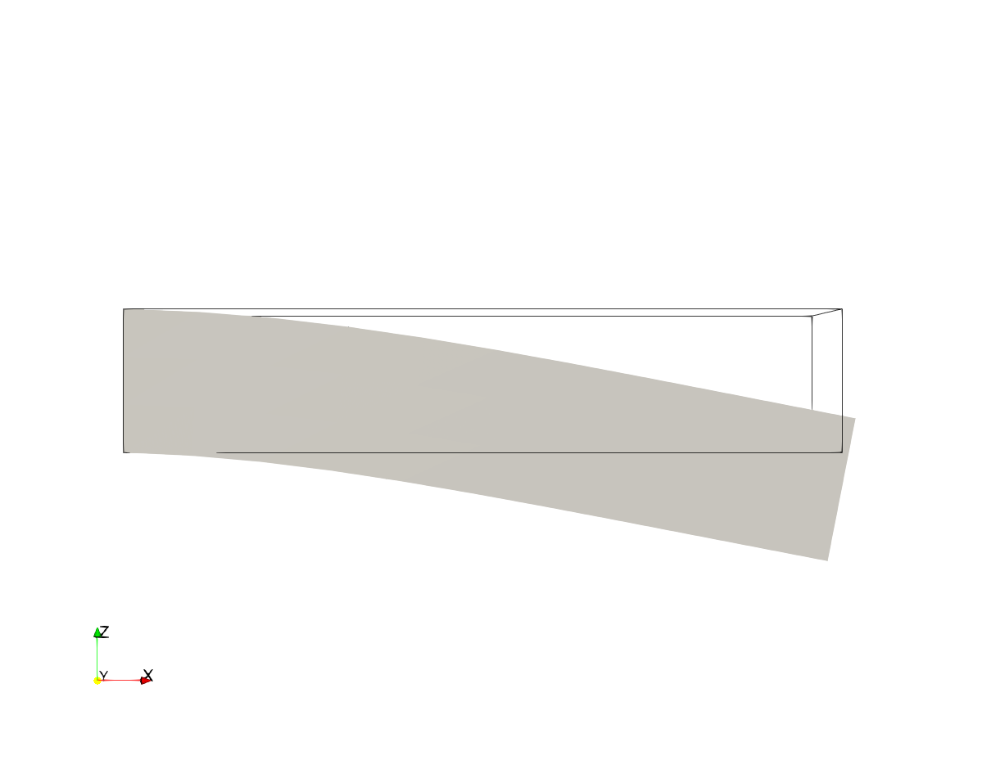

# TimeDependentElasticBeamFEniCS
Just like the elastic Beam example from the FEniCS Tutorials Book, but time dependent.

The code in this repository is based on the example "3.3 The equations of linear elasticity" from [1, p.50f]. The steady state example is extended to a time dependent one.

## Visualization

After running the code (`$ python3 elasticBeam.py`) you obtain a folder `elasticity` with output data that can be visualized using Paravie (`*.vtu` and `*.pvd`). Open paraview (`$ paraview`) and load the file `displacement.pvd`. Then apply the filter **WarpByVector** to the dataset. You can also visualize the **Outline** of the original dataset.

## References

[1] Langtangen, H. P., Logg, A., & Tveito, A. (2016). Solving PDEs in Python: The FEniCS Tutorial I. Springer International Publishing. 
